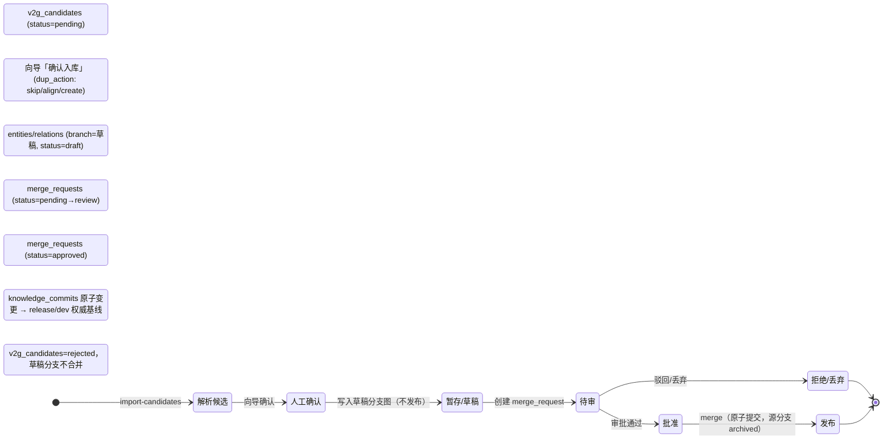

# 入库流程状态机 / 审批策略 / 暂存分支设计方案

> 版本：v1.0（2026-08-20）
> 背景：入库向导当前「确认入库」即把节点直接写入 `entities`（`source_type='ai_generated'`），关系走 `relations(status='candidate')` 审核队列——节点与关系的处理并不一致，且单次人工确认即等于发布到权威数据。用户提出设计思路：**人工确认后先进入「候选待审」，审核通过才发布入库**。本方案把这条思路形式化为一套状态机 + 可配置审批策略 + 草稿分支，并复用平台已有的分支合并基础设施（`branches` / `merge_requests` / `knowledge_commits`）。

---

## 1. 背景与目标

现状主链路是「AI 生成 SysML → `import-candidates` 解析落候选表 → 向导确认（`/api/knowledge/v2g/confirm` → `confirm_candidates`）→ 写入图数据库」。问题不在解析或抽取，而在**发布边界**：确认即入库，等于把"一次人工点击"当成了发布天花板。

目标：

1. 节点与关系走**统一的候选→待审→发布状态机**，不再一个直接入库、一个先进审核队列。
2. 确认后的数据先落在**草稿分支（暂存图）**，审核批准才并入权威基线，未批准可丢弃、可回滚。
3. **审批策略可配置**：按来源可靠度/类型/置信度决定「自动批准」或「强制待审」，兼顾吞吐与治理。

这套目标全部落在既有基础设施上，不需要另起炉灶。

---

## 2. 现状与缺口（代码证据）

### 2.1 现状链路

```
AI/SysML ──▶ sysml_versions.import_candidates ──▶ v2g_candidates(pending)
                                                        │
                向导「确认入库」 /api/knowledge/v2g/confirm ──▶ confirm_candidates
                                                        ▼
             节点 ──▶ entities(source_type=ai_generated, branch=dev)   ← 直接生效
             关系 ──▶ relations(status='candidate')                    ← 进审核队列
```

确认器 `confirm_candidates`（[vector2graph.py](file:///c:/Users/gefei/WorkBuddy/2026-08-04-19-05-52/mbse_system/vector2graph.py#L658)）行为：

- **节点候选**：`matching_status` 非空时按 `dup_action`（skip/align/create）处理，否则直接 `GraphStore.create_node` 写 `entities`，`source_type='ai_generated'`、回写 `sysml_version_id`——**一次写入即成为当前分支数据**。
- **关系候选**：写 `relations` 后置 `status='candidate'`，进入关系审核队列才生效——这里其实已经"半待审"。
- 写前过 `staging_fuse.fuse_batch + quality_gate`（批内合并 + 质量闸，失败仅告警向后兼容）。

### 2.2 已存在的分支/审批/提交基础设施

[schema.py](file:///c:/Users/gefei/WorkBuddy/2026-08-04-19-05-52/mbse_system/database/schema.py) 已经定义：

| 表 | 关键字段 | 说明 |
|---|---|---|
| `entities` | `status`（raw_chunk\|candidate\|reviewed\|deprecated）、`branch`、`PRIMARY KEY(id, branch)`、`source_type`、`sysml_version_id` | 实体本身已按分支存在 |
| `relations` | `status`、`branch` | 关系按分支 + 审核状态 |
| `branches` | `branch_type`（release\|dev\|local）、`parent_branch`、`status`（active\|merged\|archived） | 分支元数据齐备 |
| `merge_requests` | `source_branch`、`target_branch`、`status`（pending\|approved\|rejected\|merged）、`release_version` | 合并审批单已齐备 |
| `knowledge_commits` | `branch`、一次导入/审核/合并 = 一次原子变更 | Git 式提交链（含提交基线迁移） |

也就是说，平台的 **"分支 + Merge Request 审批 + 原子提交"** 能力已经存在（见《分支版本管理方案.md》）。**缺口只在 AI 建模入库这条链没有接入它**——`confirm_candidates` 还停留在"写默认分支 `dev` + 部分走审核队列"的混合状态。

---

## 3. 行业与标准依据

### 3.1 生命周期评审闸（ISO/IEC/IEEE 15288）

工程模型是权威工件，标准要求经历 **建议 → 评审 → 批准 → 基线化**。直接把抽取结果一次性写入权威库会丢失变更控制。AI/低可信来源的内容尤其应先在"评审闸"外停留，批准后才成为基线。

### 3.2 MBSE 数据治理与变更管理（CR）

权威图库作为数据底座，应满足：可回滚、可审计、有版本基线。行业通行的做法是 **变更单（Change Request）驱动**——变更在草稿态完成、审批通过后合并生效，与"Git 式"分支+合并一致，且能追溯每个三元组的 来源/版本/审核人/时间（Provenance）。

### 3.3 知识融合的置信度分级 + HITL

行业共识：机器抓吞吐与预判、人工做最终裁决。高置信（≥0.85）快审、中置信抽查、低置信重点复核。平台已有 `merge_requests` 审批 + `staging_fuse/quality_gate` 质量闸，正好承载"审批策略可配置"的分级。

### 3.4 结论

用户的思路（确认→待审→发布）与上述标准同向，且**平台已具备落地载体**。真正要做的是：把 AI 入库链接到「草稿分支 + Merge Request + 原子提交」上，并把"待审"从关系专项扩展为节点与关系的统一关卡。

---

## 4. 目标状态机设计

统一的状态机（节点与同等）：

```
解析候选       人工确认        审核(可配置)      合并发布
 v2g_candidates ──▶ 暂存/草稿 ──▶ review ──▶ approved ──▶ 权威基线
 pending            draft      merge_request    merge
                     (写入草稿  pending →       (knowledge_commits
                      分支图)     approved)       原子变更→ release/dev)
```



图：AI 建模入库目标状态机（节点与关系等同，状态对应 4.1 五态定义）

### 4.1 五态定义

| 阶段 | 载体 | 说明 |
|---|---|---|
| 1 解析候选 | `v2g_candidates`（status=pending） | import-candidates 写入，尚未触碰任何分支图 |
| 2 人工确认 | 写**草稿分支**图（`entities/relations`，branch=草稿，status=draft） | 向导「确认入库」＝把候选固化到暂存草稿图，**不发布**；`dup_action` skip/align/create 语义保留 |
| 3 待审 | `merge_requests`（status=pending→review）| 节点与关系都进审批单；低风险来源可自动置 approved |
| 4 批准 | `merge_requests` approved | 审批通过，准备合并 |
| 5 发布 | `knowledge_commits` 原子变更合并入目标分支（release/dev 权威基线）；源分支 archived | 权威图库更新，全程留痕可回滚 |

约束：**草稿分支里的数据（第 2 态）不属于权威基线**，不进入检索/导出/下游消费；第 5 态发布后才是"已入库"。这与现状"确认即入 dev"形成明确分界。

### 4.2 与现状字段的映射

- 草稿分支：新建 `branches` 行（`branch_type=local`，`parent_branch=dev`），命名如 `ai_draft_<batch>`；`entities/relations.branch` 指向它。
- 待审：新增一条 `merge_requests(source_branch=草稿, target_branch=dev, status=pending)`。
- 批准：`merge_requests.status=approved`。
- 合并：`knowledge_commits` 记录一次原子变更，源分支 `status=archived`。
- 拒绝/跳过：`v2g_candidates.status='rejected'`（含 `reject_reason`），草稿分支不合并。

### 4.3 回滚

未批准即丢弃：删除草稿分支上的 `entities/relations` 及分支行，`v2g_candidates` 置 rejected。已发布后回滚：利用 `knowledge_commits` 提交链执行反向变更（移除该批节点/关系）。两者都不改动权威数据语义，符合 3.2 的审计要求。

---

## 5. 暂存分支与合并设计

复用既有表结构，不新增主数据表。落地要点：

1. **草稿分支生命周期**：`import-candidates` 建候选时同时（或确认时）创建 `ai_draft_<batch>` 分支；向导确认只写这个分支；审批通过后并入 dev/release。
2. **分支内消歧前置**：确认时在草稿分支内先跑 `staging_fuse.fuse_batch` 批内合并 + 与目标分支 `entities` 的重复检测（复用 `entity_resolver`），把 skip/align/create 决策固化进草稿，避免把重复带进权威库。
3. **合并一致性**：合并时校验关系端点、本体类型、重复三元组（业界：入库前做知识融合，不先入库再清理）；`merge_requests.release_version` 用于发布版本号。
4. **来源溯源**：草稿与发布的每条记录都保留 `source_type='ai_generated'` 与 `sysml_version_id`，发布后可追溯回到具体 AI 模型版本。

与《分支版本管理方案.md》的关系：本方案在其分支/合并机制之上补充"AI 入库草稿分支"这一个来源场景，不动既有手动分支管理。

---

## 6. 审批策略（可配置）

审批策略决定第 3 态是"自动通过"还是"强制人工"，用一个 `approval_policy` 规则表维护，按优先级匹配：

| 优先级 | 维度 | 示例规则 | 动作 |
|---|---|---|---|
| 1 阻断 | 冲突/质量闸 | `quality_gate.pass=false`；重复未消歧 | 强制待审（block） |
| 2 来源 | source_type | `graph`/标准 JSON/XMI 导入 | **自动批准**（豁免） |
| 3 类型 | entity/relation 类型 | 本体白名单内且方向合法 | 自动批准（可选开启） |
| 4 置信度 | confidence | ≥0.85 快审 | 自动批准；0.6–0.85 抽查；<0.6 强制待审 |
| 5 默认 | — | AI 文本片段 | **强制待审** |

设计意图：**高可信来源（标准导入）可低摩擦通过，低可信 AI 生成片段默认待审**，与"确认即入库 vs 待审"之争形成可调的分档，而非一刀切。运营者为单一可信管理员时，可把策略整体设为"自动批准"退化为现状，覆盖两种诉求。

---

## 7. 数据表与接口改动

### 7.1 数据表

- `approval_policy`（新增）：规则优先级、维度、条件、动作（auto_approve / require_review / block）。
- `/api/knowledge/v2g/confirm` 行为调整（[knowledge.py](file:///c:/Users/gefei/WorkBuddy/2026-08-04-19-05-52/mbse_system/routers/knowledge.py#L1529)）：`confirm_candidates` 改为"写入草稿分支 + 建 merge_request"，不再直接写 dev。
- 复用既有：`branches`、`merge_requests`、`knowledge_commits`、`v2g_candidates`（补 `branch`/审批相关留痕字段）。

### 7.2 接口

- 新增：`POST /api/knowledge/v2g/drafts`（建草稿）/ `POST /api/knowledge/v2g/drafts/{id}/submit`（提交审批）/ `GET /api/knowledge/approval-policy`（读策略）。
- 复用/扩展：`merge_requests` 审批接口（`pending→approved/rejected`）、`POST /api/knowledge/merge`（合并发布 + 提交链）。
- 现有 `POST /api/knowledge/v2g/{extract|candidates|reject}`（[knowledge.py](file:///c:/Users/gefei/WorkBuddy/2026-08-04-19-05-52/mbse_system/routers/knowledge.py#L1439)）不变。

### 7.3 交互改动

- 入库向导：确认按钮改为"确认并提交待审"，确认后落入"草稿分支"视图，显示待审批次列表。
- 审核工作台：新增"草稿批次"一栏，展示批次级 merge_request、重复簇、质量闸结果，支持 单批通过/驳回/丢弃。
- 状态可视：候选表/草稿/审核/已发布四段进度一眼可见（与现有 `_relLabel`、批次卡片复用同一套 UI 语言）。

---

## 8. 落地步骤与里程碑

| 阶段 | 内容 | 验证 |
|---|---|---|
| P0 状态机打通 | confirm 改写草稿分支 + 建 merge_request；merge 原子提交到 dev | 向导确认后 dev 无数据，merge 后出现且带 source_type/version 溯源 |
| P1 审批策略 | approval_policy 表 + 自动/强制分档；标准导入豁免 | 配置"AI→强制待审、graph→自动批准"后两类来源分别落入两态 |
| P2 治理闭环 | 拒绝/丢弃/回滚 + 提交链反向变更；质量闸接入待审提示 | 发布后回滚可完整移除该批次 |
| P3 兼容性 | 单一可信管理员"全部自动批准"退化路径 | 等效现状，无摩擦 |

每阶段上线前在 8000 端口用真实库走一遍「导入→确认→待审→批准→发布→回滚」的端到端验证，按仓库既有回归冒烟（`verify_p1_blocking_smoke` 等）兜底。

---

## 9. 风险与规避

| 风险 | 影响 | 规避 |
|---|---|---|
| 多一态增加操作摩擦 | 交付节奏变慢 | 审批策略按来源分档，高可信来源自动批准；默认策略贴近现状 |
| 草稿分支数据被误消费 | 权威被污染 | 消费/检索/导出侧按 `branch` 过滤，仅权威基线上线 |
| AI 片段类型仍塌缩成"部件" | 待审也挡不住类型丢失 | 待审只解决"何时发布"，类型白名单与 SysML→本体映射另立专项（见《AI建模入库向导问题分析与方案.md》） |
| 与既有手动分支管理冲突 | 分支语义混乱 | 草稿分支限定 `branch_type=local` 且来源标识 `ai_generated`，走独立命名空间 |

---

## 10. 与「文档抽取实体/关系」流程的一致性 / 兼容性说明

### 10.1 一致性：两条流本就共用同一条链路

从文档抽取实体/关系（知识抽取）与 AI 建模入库在代码上共用同一套候选与确认机制：

- **共用候选表**：文档抽取 `extract_candidates`（[vector2graph.py](file:///c:/Users/gefei/WorkBuddy/2026-08-04-19-05-52/mbse_system/vector2graph.py#L537)、关系候选 L555，含文档上传按 `doc_id` 自动抽取）与 AI 建模 `sysml_to_candidates`（[sysml_importer.py](file:///c:/Users/gefei/WorkBuddy/2026-08-04-19-05-52/mbse_system/sysml_importer.py#L809)）都写入同一张 `v2g_candidates`，差异仅体现在 `source_doc` / `source_type`。
- **共用确认器**：两者最终都经 `knowledge_service.v2g_confirm → confirm_candidates`（`POST /api/knowledge/v2g/confirm`，[knowledge.py](file:///c:/Users/gefei/WorkBuddy/2026-08-04-19-05-52/mbse_system/routers/knowledge.py#L1529)）确认入库，共享 `dup_action(skip/align/create)`、本体校验、`staging_fuse` 融合闸、`chunk→entity` 溯源。

因此本方案的改动集中在 `confirm_candidates` **一个点，文档抽取与 AI 建模两条流同时生效**，不会出现两套状态机。作为代价，文档抽取当前同样存在的"确认即直接入库 + 关系才进审核队列"不一致缺漏，也会随本方案一并修复，属正向影响。

### 10.2 兼容原则：把"来源"制度化，而非给 AI 写死分支判断

审批策略（第 6 节）按来源分档，复用既有 `source_type` 字段，零新增概念：

| 维度 | 文档抽取 | AI 建模 |
|---|---|---|
| `source_type` | `graph` / `vector` / `manual` | `ai_generated` |
| 审批策略默认档 | 自动批准（高可信，可豁免） | 强制待审 |
| 草稿分支 | `draft_<batch_id>`（与 AI 同规） | `draft_<batch_id>` |

即不因来源建两套状态机，只新增"来源"一个判别维度。文档抽取默认落在可自动批准档位，无额外摩擦；AI 生成默认待审。

### 10.3 需处理的兼容措施

1. **存量迁移**：库内既有 `pending` 候选 / 已确认记录需映射进新状态机。建议：历史已确认但未进旧审核队列的记录，视作已位于 `dev` 权威历史，不追溯补建草稿；仅对存量 `pending` 候选保留原待确认语义，并在批准/重建时落入草稿态。
2. **与既有审核队列统一**：现状关系走 `relations(status='candidate')` 审核队列、实体走 `reviewed` 审核流程（见《审核队列重复数据处理优化设计方案.md》）。本方案的 `review` 态必须与这两条既有审核队列**合并对齐**，避免出现"`merge_request` 审批 + `relations.candidate` 审核"双轨。
3. **默认审批 profile**：默认配置让 `graph`/`manual` 全自动批准、仅 `ai_generated` 强制待审，保证文档抽取流程上线后零摩擦，不破坏现有提取效率。

结论：与文档抽取流程**不一致的问题不存在**；方案兼容且落在共享现成设施之上（`branches` / `merge_requests` 已存在，`branches.py` 已提供分支冲突解决 UI）。落地时重点守住上述三条兼容措施即可。